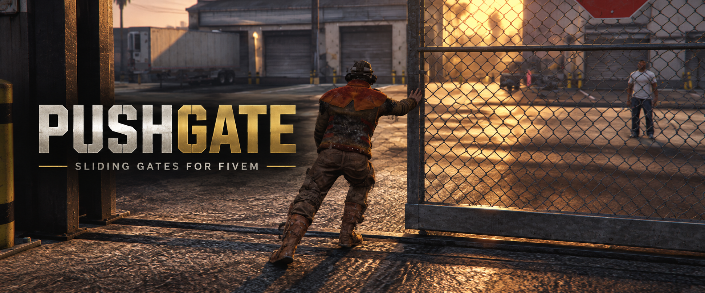

# PushGate

A small standalone FiveM script for sliding gates. Walk up to a supported gate, hold **E**, and move along the rail to push or pull it. Let go and it stays there until somebody moves it again. No framework or database needed.

Made by XanderP. If you need help or want to show what you built, come by our [Discord](https://discord.gg/cMqazwj6c7).

## Install

1. Put this folder in your server's resources as `push_gates`.
2. Add `ensure push_gates` to `server.cfg`.
3. Restart the server or start the resource.

Gate positions are kept for the current session. They reset on a resource or server restart.

## Using it

Only one player can hold a gate at a time. It moves while you walk along it; you can push either way. Let go, get too far away, enter a vehicle, or disconnect and someone else can grab it. Other players see the gate move too.

The script works on its own with hold **E**. There are optional `ox_target`, `qb-target`, and BS19 target modes if you use one of those. Gate models, travel distance, speed, prompt position, and interaction mode are in `config.lua`.

## Admin menu

Use `/pushgatedebug`. Give your admins the `pushgates.admin` ACE permission, or add their identifiers to `Config.admins`. The menu lets you tune the controls and test push animations.

To try a different GTA animation, paste its **dictionary** and **clip name** in the Animation section, then click **Try animation**. It checks that the clip actually loads before using it. This choice is for your client session; to keep it after a restart, add the pair to `Config.anim` in `config.lua`. Some GTA animations will look odd on a gate, so try a few and pick what fits.

Menu setting changes sent with **Apply to everyone** are temporary too. Put your final values in `config.lua` if you want to keep them.

## Handy commands

- `/gateinfo` shows the nearest gate and where it's sitting.
- `/gatescan` shows nearby gate objects and whether this script knows them.
- `/gatetravel <metres>` and `/gateaxis` help tune a gate model locally.
- `/gateanim` cycles the configured animations.
- `/gategripdebug` shows the hand target while testing.

This is made for sliding gates. If a gate don't get a prompt, use `/gatescan` and add its model to `Config.models`. If it moves the wrong way or cuts through a fence, check the axis and travel distance.
